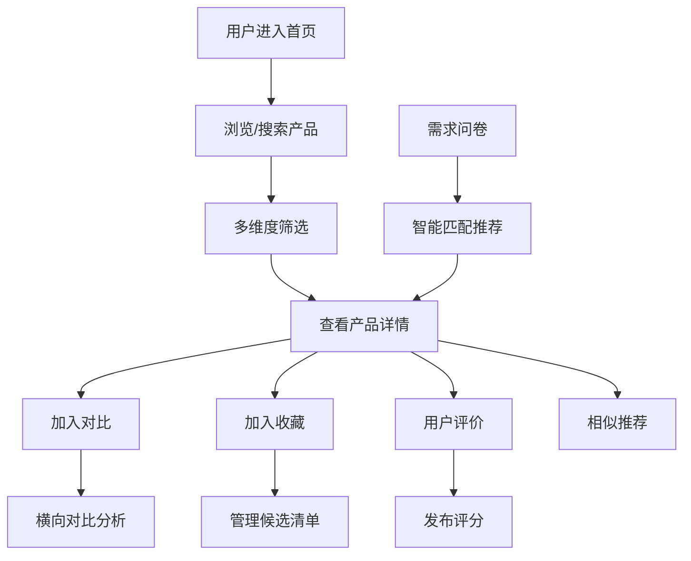

## 1. 产品概述

SaaS 发现平台是一款帮助中小企业负责人快速发现、比较和选型企业级软件的工具。平台覆盖办公、财务、客服、营销等多个品类，提供多维度筛选、横向对比、真实评价和智能推荐功能，大幅降低企业软件选型成本。

- 目标用户：中小企业决策者、IT 负责人、部门经理
- 核心价值：降低选型成本、提高决策效率、发现优质工具
- 商业模式：工具发现 + 推荐引流 + 评价社区

## 2. 核心功能

### 2.1 用户角色

| 角色 | 注册方式 | 核心权限 |
|------|----------|----------|
| 普通用户 | 无需注册（游客） | 浏览目录、筛选对比、查看详情、使用问卷 |
| 注册用户 | 邮箱/手机号 | 收藏产品、提交评价、保存清单、接收推荐 |
| 运营人员 | 后台账号 | 录入产品、合并条目、管理榜单、审核评价 |

### 2.2 功能模块

1. **软件目录页（首页）**：产品列表、多维度筛选、搜索、分类导航、产品卡片
2. **产品对比页**：横向对比表格、核心指标对比、优缺点对比、添加/移除产品
3. **榜单页**：分类排行榜、评分榜单、热度榜单、编辑推荐
4. **收藏清单页**：我的收藏、候选清单管理、导出分享
5. **需求问卷页**：智能选型问卷、需求匹配、推荐结果
6. **后台维护页**：产品管理、榜单管理、重复合并、评价审核

### 2.3 页面详情

| 页面名称 | 模块名称 | 功能描述 |
|---------|---------|---------|
| 软件目录页 | 顶部导航 | Logo、搜索框、导航菜单、用户中心入口 |
| 软件目录页 | 分类筛选栏 | 行业、预算、团队规模、部署方式等多维度筛选 |
| 软件目录页 | 产品列表 | 卡片式布局，展示产品 Logo、名称、评分、价格、标签 |
| 软件目录页 | 产品卡片 | 收藏按钮、对比按钮、快速查看入口 |
| 产品详情弹窗 | 基本信息 | 产品简介、Logo、官方链接、价格区间 |
| 产品详情弹窗 | 核心功能 | 功能列表、适合场景 |
| 产品详情弹窗 | 优缺点 | 优势分析、不足提醒 |
| 产品详情弹窗 | 用户评价 | 评分展示、评价列表、写评价入口 |
| 产品详情弹窗 | 相似推荐 | 同类工具推荐 |
| 产品对比页 | 对比栏 | 已选产品展示、移除操作、清空对比 |
| 产品对比页 | 对比表格 | 多维度横向对比、指标高亮 |
| 产品对比页 | 对比维度 | 价格、功能、部署、集成、支持等 |
| 榜单页 | 榜单分类 | 总榜、分类榜、新锐榜、满意度榜 |
| 榜单页 | 榜单列表 | 排名展示、产品信息、升降趋势 |
| 收藏清单页 | 收藏列表 | 已收藏产品、分组管理、备注 |
| 收藏清单页 | 操作区 | 一键对比、导出、分享 |
| 需求问卷页 | 问卷引导 | 步骤式问卷、进度指示 |
| 需求问卷页 | 问题模块 | 行业、规模、预算、功能需求等问题 |
| 需求问卷页 | 结果推荐 | 匹配度展示、推荐产品列表 |
| 后台维护页 | 产品管理 | 增删改查产品信息 |
| 后台维护页 | 重复合并 | 检测重复产品、合并操作 |
| 后台维护页 | 榜单管理 | 榜单配置、排名调整 |
| 后台维护页 | 评价管理 | 评价审核、删除违规内容 |

## 3. 核心流程

### 3.1 用户选型流程
用户进入首页 → 选择分类或使用搜索 → 设置筛选条件 → 浏览产品卡片 → 查看产品详情 → 加入对比/收藏 → 对比多个产品 → 提交试用/评价

### 3.2 智能推荐流程
用户填写需求问卷 → 系统分析需求 → 计算匹配度 → 生成推荐列表 → 用户查看推荐 → 加入对比/收藏

### 3.3 运营管理流程
运营登录后台 → 录入/编辑产品 → 检测重复条目 → 合并处理 → 维护榜单 → 审核用户评价

## 4. 用户界面设计

### 4.1 设计风格
- **主色调**：深海蓝 #1e3a5f 为主色，搭配活力橙 #ff6b35 为强调色
- **设计理念**：专业稳重与现代科技感结合，体现企业级工具的专业属性
- **按钮风格**：圆角矩形，主按钮有微妙渐变和阴影效果
- **字体**：标题使用 Playfair Display 衬线体彰显专业，正文使用 Inter 无衬线体保证可读性
- **布局风格**：卡片式布局 + 侧边筛选栏 + 顶部导航
- **图标风格**：线性图标 + 彩色分类图标
- **视觉效果**：磨砂玻璃效果、微妙渐变、卡片悬浮动效

### 4.2 页面设计概览

| 页面名称 | 模块名称 | UI 元素 |
|---------|---------|---------|
| 软件目录页 | 顶部导航 | 深色导航栏、搜索框高亮、下拉菜单 |
| 软件目录页 | 筛选栏 | 标签式筛选、滑块预算筛选、展开/收起 |
| 软件目录页 | 产品卡片 | 悬浮阴影、Logo 占位、评分星星、价格标签 |
| 产品对比页 | 对比表格 | 固定表头、差异高亮、滚动同步 |
| 榜单页 | 榜单列表 | 排名徽章、升降箭头、金银铜配色 |
| 需求问卷页 | 问卷流程 | 步骤指示器、卡片式选项、进度动画 |
| 后台维护页 | 管理面板 | 侧边菜单、数据表格、操作按钮组 |

### 4.3 响应式
- 桌面端：三栏布局（筛选 + 列表 + 详情弹窗）
- 平板端：两栏布局，筛选可折叠
- 移动端：单列布局，底部 Tab 导航，筛选使用底部弹层

### 4.4 动效设计
- 页面加载：元素渐入 + 轻微上移动画
- 卡片悬浮：阴影加深 + 轻微上浮
- 筛选切换：平滑过渡动画
- 模态框：缩放 + 淡入效果
- 对比添加：飞入动画到对比栏
