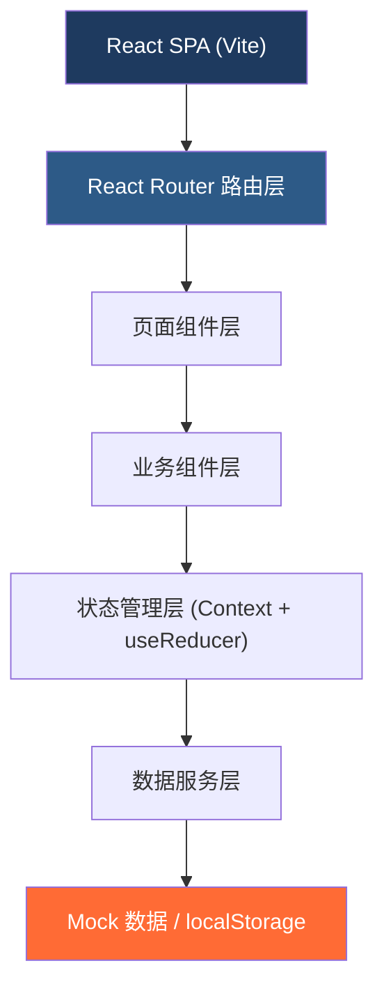
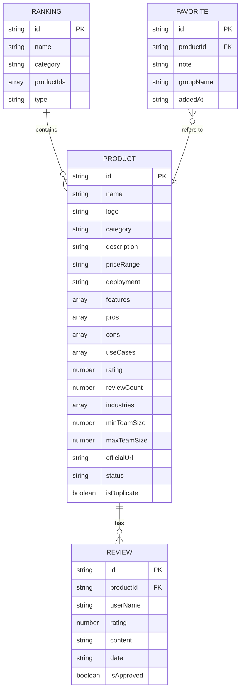

## 1. 架构设计



## 2. 技术选型

- **前端框架**：React@18 + TypeScript
- **构建工具**：Vite@5
- **样式方案**：TailwindCSS@3 + CSS 变量
- **路由管理**：React Router DOM@6
- **状态管理**：React Context + useReducer（轻量级方案）
- **图标库**：Lucide React
- **数据持久化**：localStorage 存储用户数据
- **数据来源**：前端 Mock 数据（无后端）

## 3. 路由定义

| 路由路径 | 页面名称 | 说明 |
|---------|---------|------|
| / | 软件目录页 | 首页，产品列表 + 筛选 |
| /compare | 产品对比页 | 横向对比多个产品 |
| /ranking | 榜单页 | 各类排行榜 |
| /favorites | 收藏清单页 | 我的收藏与候选清单 |
| /survey | 需求问卷页 | 智能选型问卷 |
| /admin | 后台维护页 | 运营管理后台 |
| /product/:id | 产品详情页 | 产品详细信息 |

## 4. 数据模型

### 4.1 数据实体定义



### 4.2 核心数据结构

```typescript
// 产品类型
interface Product {
  id: string;
  name: string;
  logo: string;
  category: 'office' | 'finance' | 'customerService' | 'marketing' | 'collaboration' | 'hr' | 'design';
  description: string;
  priceRange: {
    min: number;
    max: number;
    unit: 'month' | 'year' | 'user';
    type: 'free' | 'paid' | 'freemium' | 'custom';
  };
  deployment: ('cloud' | 'private' | 'hybrid' | 'onPremise')[];
  features: string[];
  pros: string[];
  cons: string[];
  useCases: string[];
  rating: number;
  reviewCount: number;
  industries: string[];
  minTeamSize: number;
  maxTeamSize: number;
  officialUrl: string;
  status: 'active' | 'pending' | 'merged';
  similarProducts: string[];
  createdAt: string;
  updatedAt: string;
}

// 评价类型
interface Review {
  id: string;
  productId: string;
  userName: string;
  avatar?: string;
  rating: number;
  content: string;
  date: string;
  isApproved: boolean;
}

// 收藏项
interface Favorite {
  id: string;
  productId: string;
  note?: string;
  groupName: string;
  addedAt: string;
}

// 筛选条件
interface Filters {
  category?: string;
  industries?: string[];
  budgetMin?: number;
  budgetMax?: number;
  teamSizeMin?: number;
  teamSizeMax?: number;
  deployment?: string[];
  search?: string;
  sortBy?: 'rating' | 'price' | 'popular' | 'newest';
}
```

## 5. 项目结构

```
src/
├── components/          # 公共组件
│   ├── Layout/         # 布局组件
│   ├── ProductCard/    # 产品卡片
│   ├── ProductDetail/  # 产品详情模态框
│   ├── FilterPanel/    # 筛选面板
│   ├── CompareBar/     # 对比栏
│   ├── Rating/         # 评分组件
│   └── common/         # 通用组件（按钮、模态框等）
├── pages/              # 页面组件
│   ├── Catalog/        # 软件目录页
│   ├── Compare/        # 产品对比页
│   ├── Ranking/        # 榜单页
│   ├── Favorites/      # 收藏清单页
│   ├── Survey/         # 需求问卷页
│   └── Admin/          # 后台维护页
├── data/               # Mock 数据
│   ├── products.ts
│   ├── reviews.ts
│   └── rankings.ts
├── context/            # 状态管理
│   ├── AppContext.tsx
│   └── types.ts
├── hooks/              # 自定义 Hooks
│   ├── useProducts.ts
│   ├── useCompare.ts
│   └── useFavorites.ts
├── utils/              # 工具函数
│   ├── filter.ts
│   ├── storage.ts
│   └── matching.ts
├── styles/             # 全局样式
├── types/              # TypeScript 类型定义
├── App.tsx
├── main.tsx
└── index.css
```

## 6. 核心功能实现方案

### 6.1 产品筛选
- 前端基于 filters 状态对产品数组进行实时过滤
- 使用 useMemo 优化筛选性能
- 支持多条件组合筛选

### 6.2 产品对比
- 对比产品 ID 存储在 Context 中
- 支持最多 4 个产品同时对比
- 对比表格支持固定首列，横向滚动对比

### 6.3 收藏功能
- 使用 localStorage 持久化收藏数据
- 支持分组管理和备注
- 支持一键加入对比

### 6.4 需求问卷
- 步骤式问卷，5-6 个问题
- 基于权重匹配算法推荐产品
- 结果页展示匹配度百分比

### 6.5 后台管理
- 产品 CRUD 操作
- 重复产品检测（基于名称相似度）
- 榜单管理
- 评价审核
